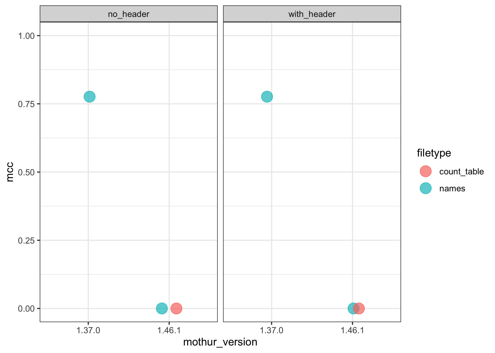

mothur sens.spec()
================

``` r
library(here)
library(tidyverse)
```

``` r
dat <- read_tsv(here('results', 'sensspec_concat.tsv')) %>% 
  mutate(list_contains_header=recode(list_header,
                                     no='with_header', with='no_header'))
```

    ## Rows: 6 Columns: 18

    ## ── Column specification ────────────────────────────────────────────────────────
    ## Delimiter: "\t"
    ## chr  (4): label, mothur_version, list_header, filetype
    ## dbl (14): cutoff, tp, tn, fp, fn, sensitivity, specificity, ppv, npv, fdr, a...

    ## 
    ## ℹ Use `spec()` to retrieve the full column specification for this data.
    ## ℹ Specify the column types or set `show_col_types = FALSE` to quiet this message.

``` r
head(dat)
```

    ## # A tibble: 6 × 19
    ##   label     cutoff     tp       tn      fp     fn sensitivity specificity     ppv
    ##   <chr>      <dbl>  <dbl>    <dbl>   <dbl>  <dbl>       <dbl>       <dbl>   <dbl>
    ## 1 userLabel   0.03 6.28e6  6.33e 8 3.23e 6 552512       0.919       0.995 6.60e-1
    ## 2 userLabel   0.03 6.28e6  6.33e 8 3.23e 6 552512       0.919       0.995 6.60e-1
    ## 3 userLabel   0.03 6.28e6 -1.83e11 1.83e11 552512       0.919    -287.    3.42e-5
    ## 4 userLabel   0.03 6.28e6 -1.83e11 1.83e11 552512       0.919    -287.    3.42e-5
    ## 5 userLabel   0.03 6.28e6 -1.83e11 1.83e11 552512       0.919    -287.    3.42e-5
    ## 6 userLabel   0.03 6.28e6 -1.83e11 1.83e11 552512       0.919    -287.    3.42e-5
    ## # … with 10 more variables: npv <dbl>, fdr <dbl>, accuracy <dbl>, mcc <dbl>,
    ## #   f1score <dbl>, mothur_version <chr>, list_header <chr>, filetype <chr>,
    ## #   numotus <dbl>, list_contains_header <chr>

``` r
dat %>% ggplot(aes(x=mothur_version, y=mcc, color=filetype)) +
  geom_point(position = position_jitter(width=0.1, height = 0),
             size = 5, alpha=0.7) +
  facet_wrap("list_contains_header") +
  ylim(0,1) +
  theme_bw()
```

<!-- -->
