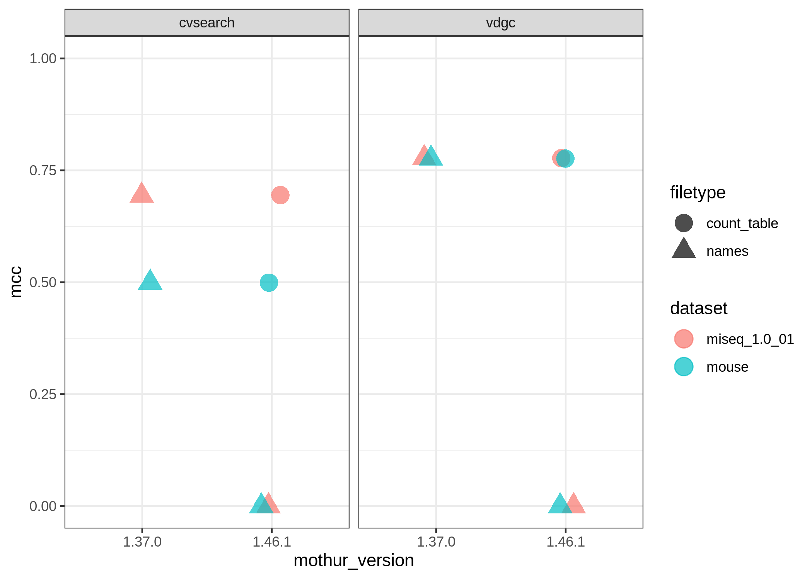

mothur sens.spec()
================

``` r
library(here)
```

    ## here() starts at /Users/kelly/projects/schloss-lab/mothur-sensspec-debug

``` r
library(tidyverse)
```

    ## ── Attaching packages ─────────────────────────────────────── tidyverse 1.3.1 ──

    ## ✓ ggplot2 3.3.5     ✓ purrr   0.3.4
    ## ✓ tibble  3.1.4     ✓ dplyr   1.0.7
    ## ✓ tidyr   1.1.3     ✓ stringr 1.4.0
    ## ✓ readr   2.0.1     ✓ forcats 0.5.1

    ## ── Conflicts ────────────────────────────────────────── tidyverse_conflicts() ──
    ## x dplyr::filter() masks stats::filter()
    ## x dplyr::lag()    masks stats::lag()

``` r
dat <- read_tsv(here('results', 'sensspec_concat.tsv'))
```

    ## Rows: 4 Columns: 17

    ## ── Column specification ────────────────────────────────────────────────────────
    ## Delimiter: "\t"
    ## chr  (3): label, mothur_version, list_header
    ## dbl (14): cutoff, tp, tn, fp, fn, sensitivity, specificity, ppv, npv, fdr, a...

    ## 
    ## ℹ Use `spec()` to retrieve the full column specification for this data.
    ## ℹ Specify the column types or set `show_col_types = FALSE` to quiet this message.

``` r
head(dat)
```

    ## # A tibble: 4 × 17
    ##   label     cutoff     tp       tn      fp     fn sensitivity specificity     ppv
    ##   <chr>      <dbl>  <dbl>    <dbl>   <dbl>  <dbl>       <dbl>       <dbl>   <dbl>
    ## 1 userLabel   0.03 6.28e6  6.33e 8 3.23e 6 552512       0.919       0.995 6.60e-1
    ## 2 userLabel   0.03 6.28e6  6.33e 8 3.23e 6 552512       0.919       0.995 6.60e-1
    ## 3 userLabel   0.03 6.28e6 -1.83e11 1.83e11 552512       0.919    -287.    3.42e-5
    ## 4 userLabel   0.03 6.28e6 -1.83e11 1.83e11 552512       0.919    -287.    3.42e-5
    ## # … with 8 more variables: npv <dbl>, fdr <dbl>, accuracy <dbl>, mcc <dbl>,
    ## #   f1score <dbl>, mothur_version <chr>, list_header <chr>, numotus <dbl>

``` r
dat %>% ggplot(aes(x=mothur_version, y=mcc, color=list_header)) +
  geom_point(position = position_jitter(width=0.1, height = 0),
             size = 5) +
  ylim(0,1) +
  theme_bw()
```

<!-- -->
