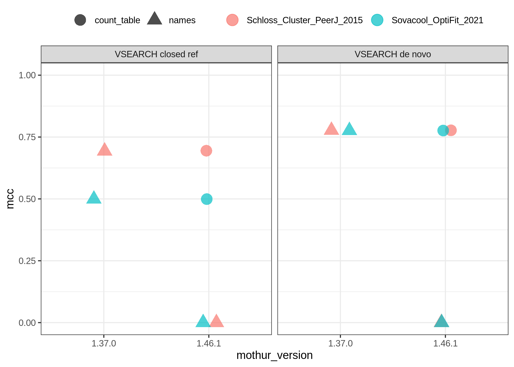

```{r setup, include=FALSE}
options(htmltools.dir.version = FALSE)
knitr::opts_chunk$set(
  fig.width=9, fig.height=3.5, fig.retina=3,
  out.width = "100%",
  cache = FALSE,
  echo = TRUE,
  message = FALSE, 
  warning = FALSE,
  hiline = TRUE
)
```

```{r xaringan-themer, include=FALSE, warning=FALSE}
library(xaringanthemer)
style_duo_accent(
  primary_color = "#1381B0",
  secondary_color = "#FF961C",
  inverse_header_color = "#FFFFFF"
)
```

---
background-image: figures/vsearch.png
background-position: bottom left
background-size: 300px 150px
layout: true
---

## _De novo_ Clustering with VSEARCH

.pull-left[

Trying to figure out why my _de novo_ VSEARCH results are different from Pat's

]
.pull-right[


]

---

## Closed-reference Clustering with VSEARCH

.pull-left[

Fixed _de novo_, but now closed is weird???

]
.pull-right[



]

